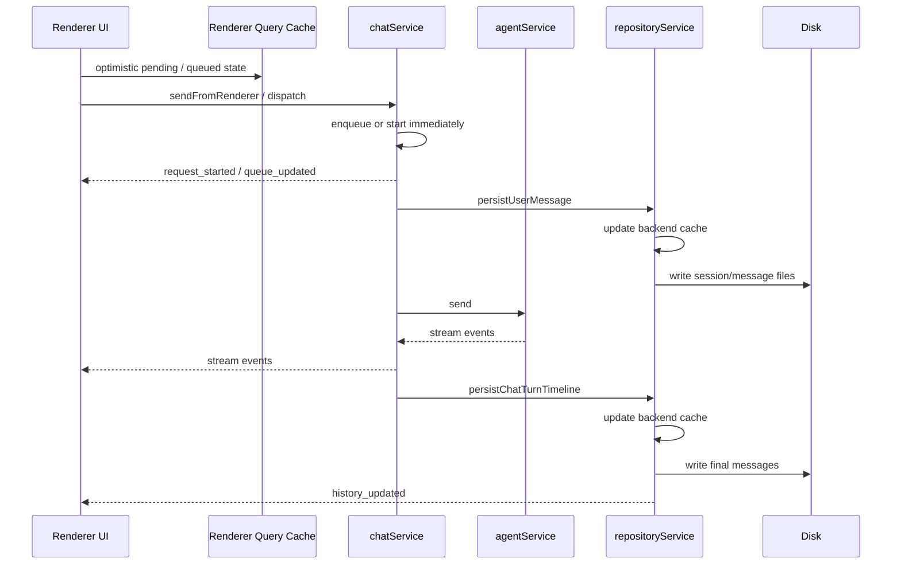

# Agent 核心架构重构说明

本文说明当前 Agent 聊天核心在会话加载、消息调度、排队、持久化和前端展示上的最终架构。

## 目标

本次重构解决的是聊天核心过去存在的几类不一致问题：

- 会话进入时，前后端对历史消息来源不一致
- 用户消息、渠道消息、子 Agent 回报分别走不同发送路径
- 队列状态只存在于部分运行时，前端恢复能力弱
- 消息写入顺序不统一，导致前端状态、缓存、磁盘可能短暂不一致
- 列表排序语义混杂了“入队时间”“创建时间”“开始处理时间”
- 委派回执消息污染主会话时间线

本次实现后的统一原则是：

- 后端缓存是会话读路径的第一来源
- 每个会话都有独立的后端内存消息队列
- 所有消息来源统一进入同一个 dispatch 入口
- 一条消息只允许有一套写入顺序和一套展示排序语义

## 关键模块

- `electron/main/services/repositoryService.ts`
  - 负责会话列表、消息列表的后端内存缓存
  - 负责缓存到磁盘的最终落盘
- `electron/main/services/chatService.ts`
  - 负责每会话消息队列
  - 负责统一 dispatch、排队、中断和流事件发射
- `electron/main/services/agentService.ts`
  - 负责真正与 Agent runtime 交互
  - 子 Agent 回报改为统一回流到 `chatService`
- `electron/main/services/chatTurnTimeline.ts`
  - 负责把流事件还原成最终持久化消息
  - 给持久化消息补充 `requestStartedAt`
- `src/renderer/modules/chat/chatQueryCache.ts`
  - 负责把主进程事件桥接到前端 query cache
- `src/renderer/modules/chat/ModuleChatPane.tsx`
  - 负责 optimistic UI、队列展示、中断展示、消息排序展示
- `src/shared/types/index.ts`
  - 定义队列事件、历史更新事件和排序所需字段

## 会话加载

### 后端缓存模型

后端按 scope 维护一份 `chatScopeCacheByKey`：

- `sessions`
- `messagesBySession`

读路径规则：

1. 进入会话时先读后端缓存
2. 缓存缺失时才从磁盘读取 `sessions.json` 和对应消息文件
3. 读取结果回填到后端缓存

这保证：

- 同一会话生命周期内，前端看到的是稳定快照
- 磁盘被动变化不会立刻污染当前活跃会话
- 后续事件补丁只需要修改缓存，不必重新扫盘

## 每会话消息队列

`chatService` 维护 `sessionQueueStore`，按 `(scope, sessionId)` 分片保存：

- `processing`
- `currentRequestId`
- `items`

`items` 中的每一项都包含：

- `payload`
- `deliveryMode`
- `queuedAt`
- `completion promise`

队列是纯内存的，不持久化。其职责是保证“同一会话同一时刻只有一条消息在被 Agent 正式处理”。

## 统一消息发送入口

所有消息来源都通过 `chatService.dispatch` 进入：

- 前端用户发送
- 渠道消息
- 子 Agent 回报

统一规则：

1. 如果该会话当前空闲，消息立即开始处理
2. 如果该会话已有消息在处理或排队，消息进入队列
3. 真正开始处理某条消息时，统一发出 `request_started`
4. Agent 的流式事件统一由 `chatService` 转发

`sendFromRenderer` 只是 `dispatch` 的前端回执包装，负责立即返回：

- `requestId`
- `queued`

前端据此决定该消息是先显示为 pending，还是直接显示在队列区。

## 持久化顺序

### 用户消息

一条用户消息开始处理后，写入顺序固定为：

1. 前端状态先插入 optimistic message
2. 后端缓存更新
3. 磁盘写入

真正落盘时通过 `persistUserMessage` 写入，并附带：

- `requestId`
- `requestStartedAt`

### Agent 响应

Agent 响应在运行过程中先形成 timeline，结束后由 `persistChatTurnTimeline` 统一展开成最终消息，并按同样顺序生效：

1. 前端状态更新
2. 后端缓存更新
3. 磁盘写入

这套顺序对以下消息类型一致生效：

- assistant
- tool
- thinking

## 排序语义

### 队列区排序

输入框上方的排队消息按 `queuedAt` 升序展示。

这表示：

- 展示语义是“谁先排队谁先显示”
- 不受真实开始处理时间影响

### 消息列表排序

消息列表按 `requestStartedAt` 排序展示。

具体规则：

- 如果消息 metadata 中有 `requestStartedAt`，优先按它排序
- 没有该字段时，再退回到消息自己的 `createdAt`

这样可以保证同一轮中的：

- user
- thinking
- tool
- assistant

都归属于同一个“开始处理时间槽”，不会因为中途工具输出或补写消息打乱轮次。

## 中断语义

中断由 `chatService.interrupt` 统一处理。

规则如下：

- 不带 `requestId` 时，取消当前会话中的全部排队项，并尝试中断当前运行中的 Agent
- 带 `requestId` 时，只移除对应排队项
- 如果中断目标是当前活跃请求，仍然会转发到 `agentService.interrupt`
- 未命中的后续排队项会被保留

前端中断后的本地队列也会按同一语义同步，不再出现“中断一条却把整个队列都清空”的情况。

## 子 Agent 回报与委派回执移除

旧实现里，子 Agent 委派会在主会话里插入一条“已委派给某 Agent”的系统回执消息。该消息会污染主时间线，也导致复用 delegated session 依赖历史扫描。

新实现改为：

- delegated session 的复用信息只保存在内存 `delegatedSessionStore`
- 子 Agent 回报统一走 `chatService.send(...)`
- 主 Agent 是否忙碌由统一队列决定
- 不再向主会话追加委派回执消息

这样主会话中只保留真实对话内容，不保留调度噪音。

## 前端缓存桥接

主进程通过两类事件把变化推送到渲染层：

- `chat:historyUpdated`
- `chat:queueUpdated`

前端 `chatQueryCache` 的处理规则：

- 已加载的消息列表：直接把 `event.message` 增量补入 query cache
- 未加载的消息列表：只失效该 query，不伪造局部历史
- 队列事件：直接覆盖该会话的 `chat-queued` query

这样前端既能实时更新，又不会在未完整加载会话时构造不完整状态。

## 会话发送时序

## 本次补强的单测覆盖

本次重构后，新增或加强了以下测试：

- `tests/unit/chatService.queue.test.ts`
  - `sendFromRenderer` 的即时回执
  - 每会话队列排队与定向中断
  - `skipUserMessagePersistence` 的队列语义
- `tests/unit/chatQueryCache.test.ts`
  - 已加载消息列表的增量补丁
  - 未加载消息列表的失效而非伪造
  - 队列快照同步
- `tests/unit/repositoryService.project.test.ts`
  - 会话和消息的缓存优先级
  - `appendMessage` 事件带完整 `message` 负载

此外，已有测试继续覆盖：

- timeline 持久化
- auto title
- Agent 队列兼容路径
- 子 Agent 委派和回报
- 全量回归

## 当前非目标

当前架构里明确没有做的事：

- 队列持久化到磁盘
- 进程重启后恢复未消费队列
- 对历史消息重新计算 `requestStartedAt`
- 跨会话共享队列

这些都不是本次重构要解决的问题。

## 总结

重构后的聊天核心已经收敛为一套统一模型：

- 后端缓存优先读取
- 每会话一个内存队列
- 所有消息来源统一 dispatch
- 所有消息统一按“前端 -> 缓存 -> 磁盘”顺序生效
- 队列按入队时间展示
- 时间线按开始处理时间排序
- 子 Agent 调度噪音不再写入主会话

这使得前端展示、后端运行态和磁盘状态的语义终于一致，后续如果继续扩展渠道接入、自动化消息或更细粒度的回放，也可以沿用同一条主链路。
